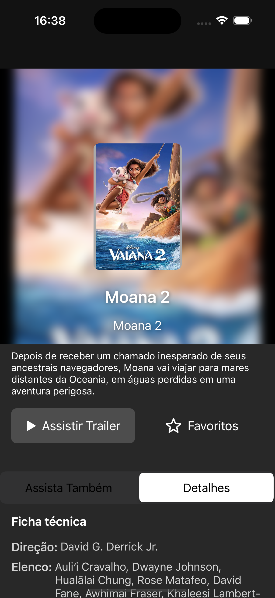
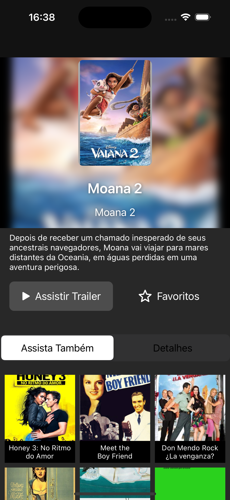
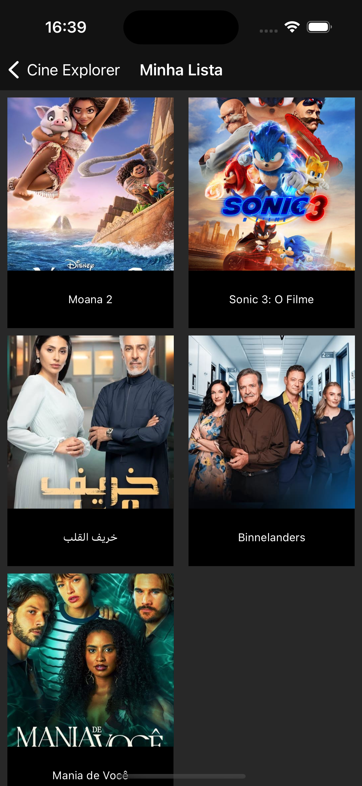
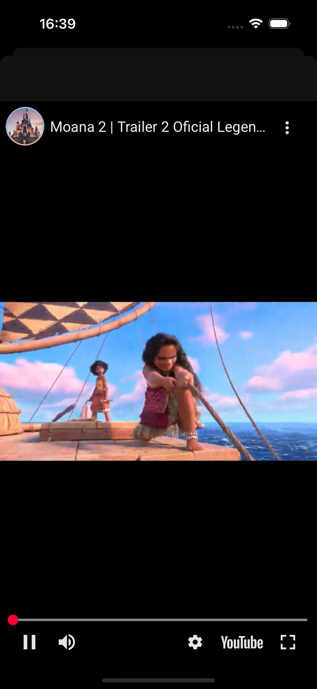
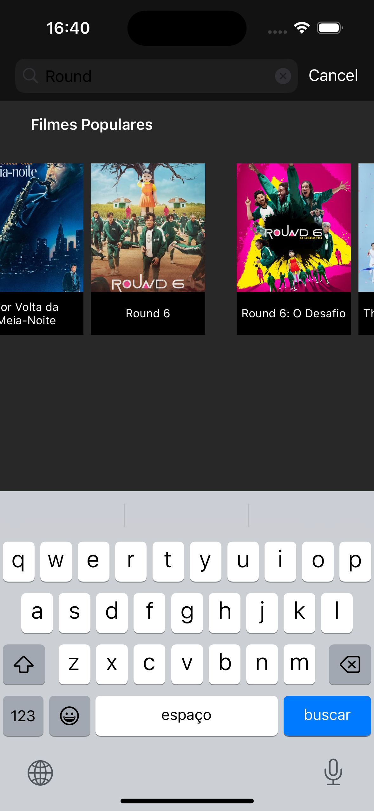

## README

# Cine Explorer

## Aplicativo para visualização de filmes e séries

## Visão Geral

Este aplicativo iOS permite aos usuários explorar o mundo do cinema e da televisão, oferecendo uma interface intuitiva para descobrir filmes e séries, visualizar detalhes, assistir trailers e gerenciar seus favoritos.

## Funcionalidades

Explore as principais funcionalidades do Cine Explorer em ação!

### Listagem de Filmes e Séries

Navegue por uma extensa coleção de filmes e séries, organizados por categorias e gêneros.

*Legenda: Tela inicial com a lista de filmes e séries, destacando a organização por categorias.*

### Detalhes

Acesse informações detalhadas sobre cada filme ou série, incluindo sinopse, elenco, classificação e muito mais.

*Legenda: Tela de detalhes de um filme, com informações sobre sinopse, elenco e classificação.*

### Filmes Relacionados

Descubra filmes e séries semelhantes àqueles que você gosta, expandindo suas opções de entretenimento.

*Legenda: Tela com filmes relacionados ao filme visualizado, permitindo explorar novas opções.*

### Favoritos

Marque filmes e séries como favoritos para acesso rápido e fácil.

*Legenda: Tela de detalhes de filme adicionado aos favoritos, com destaque para o botão de adicionar/remover como estrela.*

### Tela de Favoritos

Visualize todos os seus filmes e séries favoritos em um só lugar, com a opção de removê-los da lista.

*Legenda: Tela com a lista de filmes e séries favoritos, com a opção de remover da lista.*

### Trailers

Assista aos trailers dos seus filmes e séries favoritos para ter um gostinho do que está por vir.

*Legenda: Tela de exibição do trailer do filme, com controles de reprodução.*

### Busca

Encontre filmes e séries específicos rapidamente, utilizando a funcionalidade de busca.

*Legenda: Tela de busca de filmes e séries, com campo de texto para pesquisa e resultados da busca.*
## Arquitetura

O aplicativo foi desenvolvido utilizando a arquitetura MVVM-C (Model-View-ViewModel-Coordinator), promovendo a separação de responsabilidades e facilitando a manutenção e escalabilidade do código.

## Tecnologias

-   **Linguagem:** [Swift](https://www.swift.org/)
-   **Arquitetura:** MVVM-C
-   **Gerenciamento de Dependências:** [CocoaPods](https://cocoapods.org/)
-   **Requisições:** [Combine](https://developer.apple.com/documentation/combine/), [URLSession](https://developer.apple.com/documentation/foundation/urlsession)
-   **Carregamento de Imagens:** [SDWebImage](https://github.com/SDWebImage/SDWebImage)
-   **Testes Unitários:** [XCTest](https://developer.apple.com/documentation/xctest)
-   **Testes de Snapshot:** [SnapshotTesting](https://github.com/pointfreeco/swift-snapshot-testing)

## Testes

O aplicativo possui testes unitários abrangentes para garantir a qualidade do código e o correto funcionamento das funcionalidades. Além disso, testes de snapshot foram implementados para validar a interface do usuário e garantir a consistência visual.

## Melhorias Futuras

-   Diminuir a complexidade na tela de favoritos usando swift comcurrence; Melhorias no design.

## Autor

Filipe Xavier Fernandes

## Licença

MIT

## Como Executar

1.  Clone este repositório.
2.  Abra o projeto no Xcode.
3.  Instale as configurações rodando o scritp setup.sh
4.  Abra o projeto com open cine-explorer.xcworkspace
5.  Rode o projeto e seja feliz.

## Observações

## Observações

-   Este aplicativo utiliza a API pública [TMDB](https://www.themoviedb.org/documentation/api) para obter os dados de filmes e séries.
-   As imagens são carregadas de forma assíncrona utilizando a biblioteca SDWebImage.

## Contato

https://www.linkedin.com/in/filipe-xavier-fernandes/

